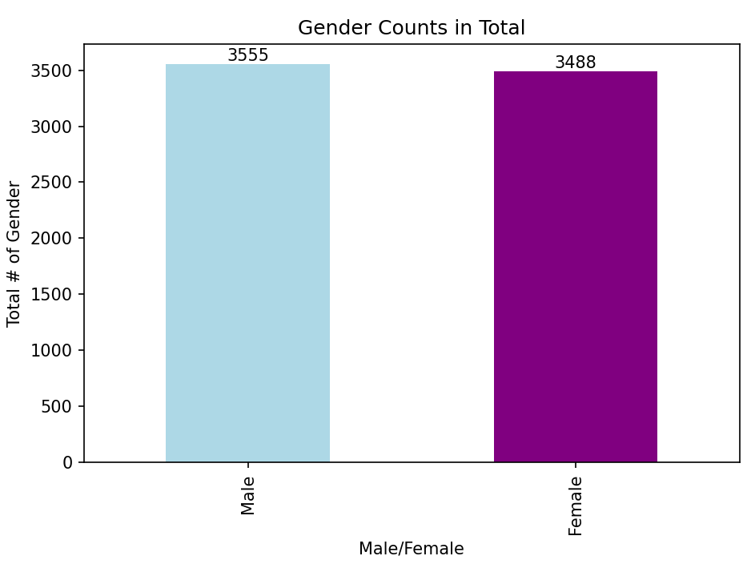
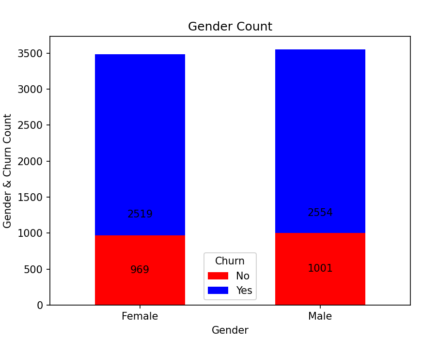
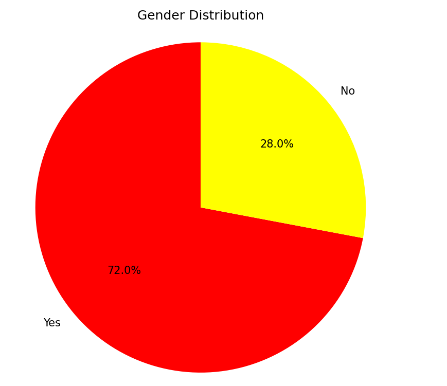
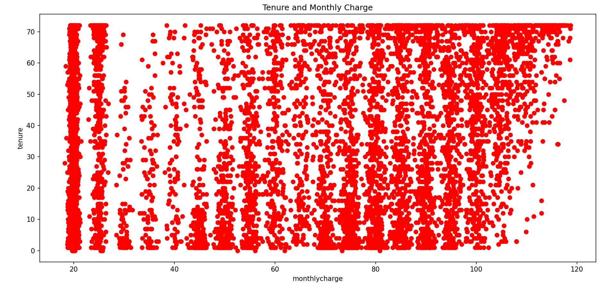

# Customer-Churn-Analysis
This Project is my Customer Churn Analysis Specifying my own set of condition. It shows my ability to perform the Explaratory Data Analysis (EDA) on a Telco dataset.

# Data Set Info
The original data I used is from Kaggle.com. Here is the link for the original dataset. https://www.kaggle.com/datasets/blastchar/telco-customer-churn/data

  # I have also uploaded this data set on my github Repo:
   [WA_Fn-UseC_-Telco-Customer-Churn.csv](https://github.com/NikeshNepali/Customer-Churn-Analysis/raw/main/WA_Fn-UseC_-Telco-Customer-Churn.csv)

  # The given datasets has rows which provides the customers details and 21 attributes like:
  - ustomerID,gender,SeniorCitizen,Partner,Dependents,tenure,PhoneService,MultipleLines,InternetService,OnlineSecurity,OnlineBackup,DeviceProtection,TechSupport,StreamingTV,StreamingMovies,Contract,PaperlessBilling,PaymentMethod,MonthlyCharges,TotalCharges,Churn

# Feature / Learned Things 
- Clean data (finding missing values, correcting the logic of churn)
- made churn column based on tenure.
- Visualized the data for: 
  - Gender count (Bar graph)
  - Distribution of Churn (Stacked Bar Chart)
  - Churn Ratio (Pie Chart)
  - Monthly Charge Vs Tenure (Scatter Plot)

# Visualization
 1. Bar Chart that shows the gender count
 
 2. Stacked Bar Chart for Churn specific to gender.
 
 3. Pie Chart 
 
 4. Scatter Plot
 

# Technologies Used
 - Python
 - Pandas
 - Matplotlib
 - Kaggle
